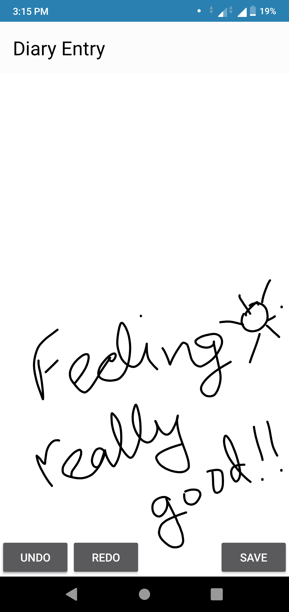
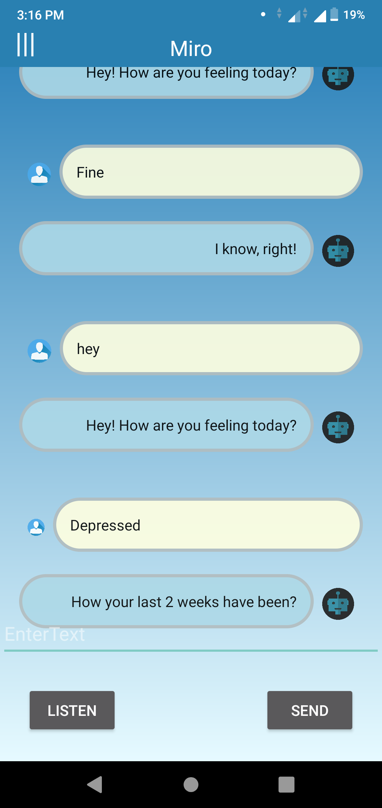

# ReflectoMate
ReflectoMate: An Android Application to detect and counter symptoms and causes of stress and depression

ReflectoMate employs a chatbot to monitor a user’s stress level and counter depression. It does so by merging standard psychological tests with casual conversation to evaluate a person’s mental state and detect symptoms of depression.
It also features a drawing board (on which a user can doodle or draw) which is then analyzed to evaluate the user’s state of mind.
It also presents the users with rewards and other exercises to prevent falling into depression and curing early symptoms.

     
    

